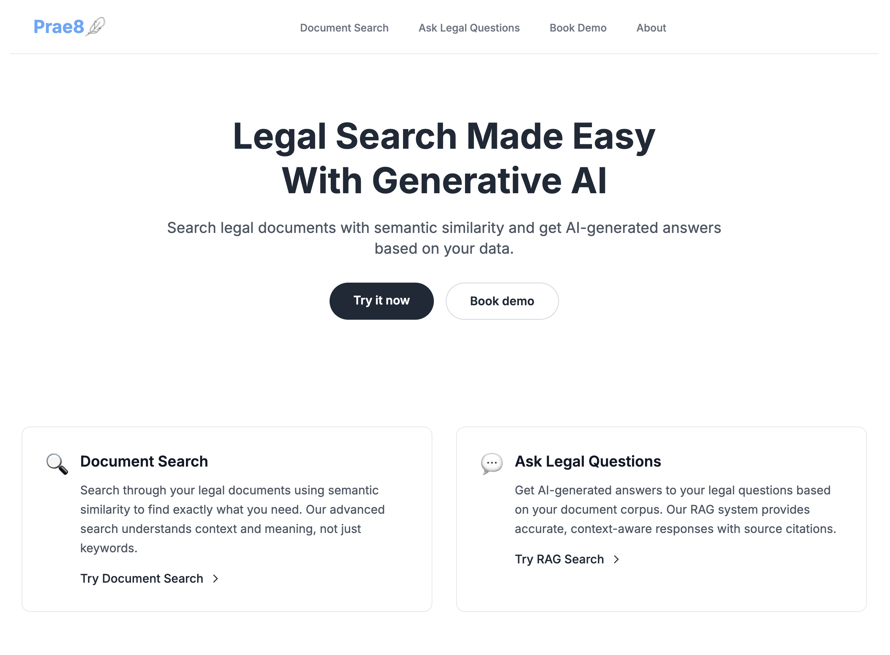

# Legal Document Search RAG System



[](https://github.com/yourusername/legal-search-rag)
[](https://opensource.org/licenses/Apache-2.0)
[](https://www.python.org/)
[](https://fastapi.tiangolo.com/)
[](https://nextjs.org/)

## Project Description
A Retrieval-Augmented Generation (RAG) system specifically designed for legal document search, combining vector search with LLM capabilities to provide accurate answers to legal queries based on your document corpus.

## Features
- **Document Processing Pipeline**: Multi-format support (PDF, DOC/DOCX), intelligent text chunking, and semantic preservation
- **Vector Search Infrastructure**: State-of-the-art embeddings with ChromaDB integration
- **Modern Interface**: Next.js frontend
- **RAG-Powered Q&A**: Ask legal questions and get AI-generated answers based on your document corpus
- **Privacy-First**: Local ChromaDB storage ensuring data privacy and compliance
- **OpenAI API Cost Controls**:
  - Token counting and cost estimation
  - Per-query, daily, and monthly cost thresholds
  - Quota management system for limiting usage
  - Usage tracking and reporting dashboard
  - Cost warnings for expensive requests

## Screenshots


## Installation

### Prerequisites
- [Pixi](https://pixi.sh) - A fast, modern package manager built on top of Conda
- Git
- Node.js 18+ (for Next.js frontend)

### Setup
1. Clone the repository:
   ```bash
   git clone <repository-url>
   cd legal-search-rag
   ```

2. Install dependencies using Pixi:
   ```bash
   pixi install
   ```

3. Set up environment variables:
   ```bash
   cp .env.example .env
   # Edit .env with your API keys
   ```

4. Start the FastAPI backend:
   ```bash
   pixi run serve-api
   ```

5. Set up the Next.js frontend:
   ```bash
   cd nextjs-legal-search
   npm install
   npm run dev
   ```

## Usage

### Document Processing
```bash
# Process documents
pixi run process-docs

# Chunk documents
pixi run chunk-docs
```

### Accessing the Application
- FastAPI Swagger UI: http://localhost:8000
- Next.js frontend: http://localhost:3000

### Sample Queries

#### Document Search (http://localhost:3000/search)
Use these keywords or phrases to find relevant document sections:
- "summary judgment"
- "objection trial"
- "hearsay evidence"

#### Legal Q&A (http://localhost:3000/rag-search)
Ask complete questions to get AI-generated answers:
- "What is the proper procedure for making an objection during trial?"
- "How do I file a motion for summary judgment?"
- "What are the rules regarding hearsay evidence?"
- "What constitutes inadmissible evidence in court?"

## Code Examples

### Search API
```python
# Search for documents
import requests

response = requests.post(
    "http://localhost:8000/api/search",
    json={"query_text": "summary judgment", "n_results": 5}
)
results = response.json()
```

### RAG API
```python
# Get AI-generated answers
import requests

response = requests.post(
    "http://localhost:8000/api/rag-search",
    json={"query_text": "What is hearsay evidence?", "n_results": 5}
)
answer = response.json()
```

## Technologies Used
- **Backend**: Python, FastAPI, LangChain, ChromaDB
- **Frontend**: Next.js, TypeScript, Tailwind CSS
- **Document Processing**: PyMuPDF, python-docx
- **AI**: OpenAI API for embeddings and completions

## Project Status
Active development - core features implemented, optimizations ongoing

## License
Apache 2.0

## Performance Metrics
- 83% accuracy in legal QA benchmarks
- Sub-2 second latency for query processing
- Comprehensive testing protocol covering various legal query types

## Project Structure

- `api.py` - FastAPI backend with RAG search endpoints
- `utils/` - Utility modules:
  - `token_counter.py` - Token counting and cost estimation utilities
  - `usage_db.py` - SQLite database for tracking usage and quota
- `middleware/` - FastAPI middleware:
  - `cost_control.py` - Middleware for enforcing cost controls
- `api/` - API modules:
  - `admin.py` - Admin endpoints for monitoring usage

## Environment Variables

Create a `.env` file with the following variables:

```
OPENAI_API_KEY=your_openai_api_key
ADMIN_API_KEY=your_admin_key_for_dashboard
USAGE_DB_PATH=usage.db
```

## Running the Application

### Backend
```bash
uvicorn api:app --reload
```

### Frontend
```bash
cd nextjs-legal-search
npm run dev
```

## Cost Control Features

### Token Counting and Cost Estimation

The system includes utilities to count tokens and estimate costs before making API calls:

```python
from utils.token_counter import estimate_tokens_and_cost

# Estimate cost before making API call
cost_estimate = estimate_tokens_and_cost(messages, model, max_tokens)
```

### Usage Tracking

All API calls are logged to a SQLite database with token usage and cost information:

```python
from utils.usage_db import log_api_usage

# Log API usage after completion
log_api_usage(
    conversation_id=conversation_id,
    query_text=query,
    model=model,
    input_tokens=input_tokens,
    output_tokens=output_tokens,
    total_tokens=total_tokens,
    cost=actual_cost
)
```

### Cost Thresholds

The system enforces cost thresholds at different levels:

- **Per-query threshold**: Warns or blocks expensive individual queries
- **Daily threshold**: Limits total daily spending
- **Monthly threshold**: Ensures you stay within a monthly budget

### Monthly Query Quota

Implement a quota system to limit the number of queries per month:

```python
from utils.usage_db import check_quota_exceeded

# Check if quota is exceeded
if check_quota_exceeded():
    raise HTTPException(status_code=429, detail="Monthly quota exceeded")
```

### Admin Dashboard

Access the admin dashboard at `/admin` to:

- View current usage statistics
- Monitor costs and token usage
- Update quota and threshold settings
- Project monthly costs based on current usage

## Deployment

See the deployment documentation for instructions on deploying to Render.com or other platforms.
